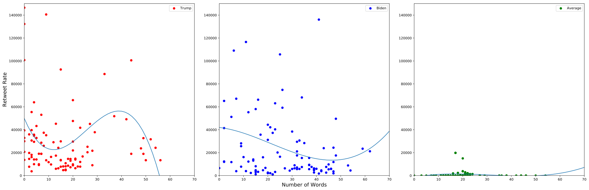

# Retweet Rates between the Presidential Candidates

If you find a piece of information so good, you probably want to share it. If it's in a newspaper, send a picture. If it's a website, just send the link. Twitter has a useful feature to share information fast: the retweet.

Retweets are a good measure of how powerfully someone speaks. If someone really wants to share some information, it should be good, right? So in this spirit, I decided to analyze the retweet rates compared to the number of words there is in each tweet.

The x-axis is the number of words while the y-axis is the number of times that tweet has been retweeted. So a dot near the top means that the tweet which it represents has been retweeted more than a dot near the bottom. If a dot is near the left, that means that it has less words than a dot near the right.

Both candidates have outliers that have been retweeted a lot: Trump has two tweets retweeted more than 120,000 times while Biden has one. Trump also tweets more concisely; more than 90% of his tweets have less than 40 words. But although Trump has more zingers than Biden, Biden's tweets get retweeted more. Biden has 9 tweets which have gotten retweeted more than 60,000 times while Trump has just 4 tweets.

I hope that graph has been interesting. I look forward to creating more graphs for your use.