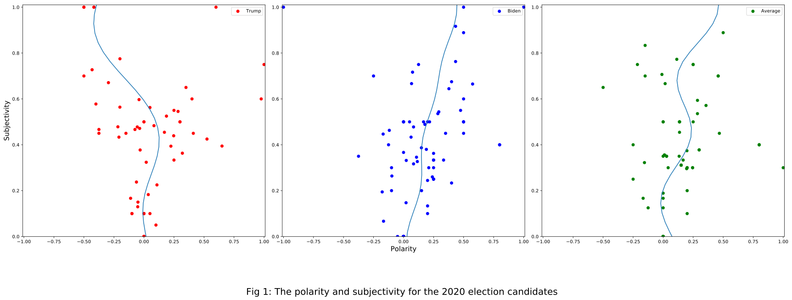

# An Analysis on the Sentiment of the Presidential Candidates

People don't realize how much information they put in the public each time they tweet. You can tell their age, their experience, their mental state, and more from just a single tweet. It must be hard running for public office because you willingly place the public spotlight on themselves. And the information that is put out there is extremely easy to access. To gain some context about an event in the spotlight, the presidental election, I did my own analysis on the subject. I wanted to see which candidate is more postive. And by graphing the results, I found an answer.

The above graph compares subjectivity (y-axis), how much opinion there is in a piece of text, vs polarity (x-axis), how positive or negative a piece of text is. I pulled 100 of President Trump's tweets, 100 of Former Vice President Biden tweets, and 100 random tweets about the election. Then, I plotted each of these groups on a graph. The blue line is an estimation of each group.

Immediately, you can see something different about President Trump's graph: his blue line heads into the upper left corner while Joe Biden and the random people's tweets heads into the upper right corner. What does this mean? When a dot is on the left side of the graph, this means that the tweet is negative. When a dot is on the right side, the tweet contains positive information. When a tweet is near the top, that means that the tweet is primarily opinion. When a tweet is near the bottom, that means that the tweet is mostly fact. Using this new understanding, let us analyze the graph.

The blue line for all three graphs starts from the bottom near zero polarity. This is expected; a fact shouldn't be positive or negative. In all three graphs, the subjectivity increases with the polarity (the more opinions are in a tweet, the more positive it is) up until when the subjectivity measures 0.4. At this point, Trump's graph veers to the left and into negative polarity while Biden's polarity keeps climbing. What is going on here? Why does Trump's graph go negative?

When you read a few of Trump's tweets and a few of Biden's tweets, you can get an answer of some sort. Trump's campaign relies on how he is better than the alternative. The logical way to get this point across is to raise the other sides negative aspects to light. Biden, on the other hand, tweets very positive messages, although they are fairly repetitive. 

So what can we *do* with this graph? By analyzing a person's tweets, you get insight into a person's mind. In my opinion, this data implies that Trump is a negative person, while Biden is a positive person who can comfort the American people. But it depends on the person interpreting the data. But however you lean, one important thing to learn is this: a person is only as good as their mind.