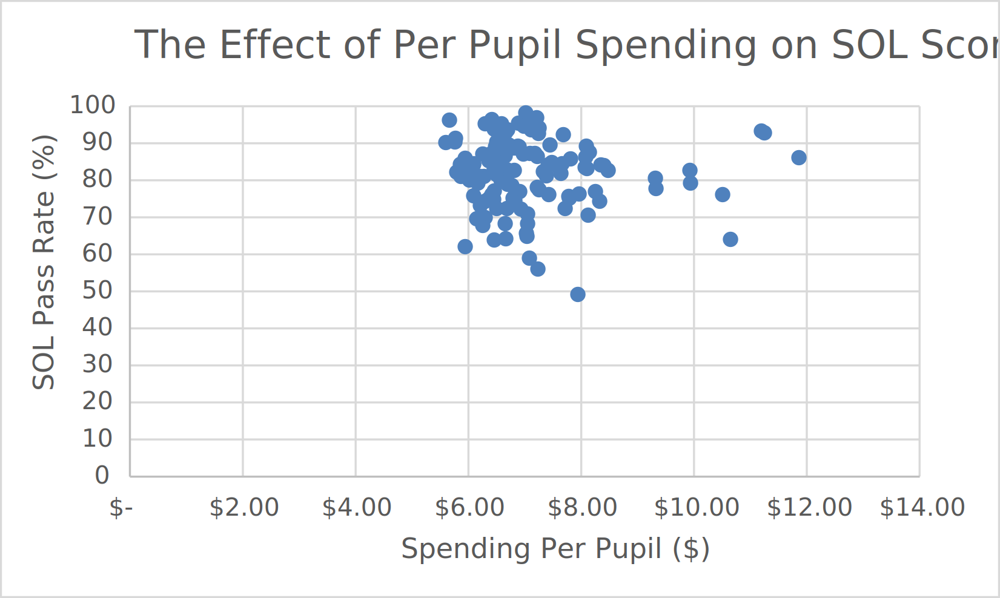

# Education in Virginia

**Note that I am still working on this!**

Say what you will about the public school system, it sure helps you get data! Indeed, there is a lot
of data out there for the taking, and having recieved this public education, I wanted to know how good
this education is. After thinking a bit more, I decided to investigate how education quality is
distributed; that is, are some places getting better education than others just because of some
special characteristics, such as race or wealth? I decided to investigate each of these in detail.

## Wealth

| Educational Affluency       | Monetary Affluency      |
:----------------------------:|:------------------------:
         |    |

I made the maps above to compare quality of education<a id='a1'>[1](#f1)</a> to median wealth in the region. As you can see,
there appears to be no or very little correlation between educational levels and the representative
person's wealth. But this leaves out one key detail:

As you can see, there appears to be a bracket in which counties can land; all counties *can* have
excellent students, but not all have students like that. But the likelihood that a county has good
students increases with wealth. That is, **those who live in wealthy counties are more likely
to pass the SOL**. That is a very obvious fact, but there is a deeper conclusion in that:

These graphs measure the *parents'* wealth, not the county's. So this means that the richer parents
are, the more they are willing to contribute to their children's education. And this creates a
fundamental inequality in terms of education. This inequality isn't about wealth, but initiative.

In richer counties, the parents provide the initiative and the drive to help their child pursue a better
education; they have more resources. The poorer counties might not be able to afford to devote
that much resources and time lest something bad happen to domestic life.

<b id='f1'>1</b> I defined quality of education as the median math SOL scores (SOLs are administered
only in VA, I think). [↩](#a1)

## Culture vs Money

One of the things I think I have found is that **this isn't a problem which can be solved by
throwing money at it!**. Although it may surprise, I found that the parents' wealth is much
more important than the money spent per pupil:

Per Pupil Spending has *nearly no* effect on SOL Performance! I've chalked this up to a lack
of initiative; as said above, poorer people might not be as willing or as able to pursue a better
education. 

## To Be Continued...
