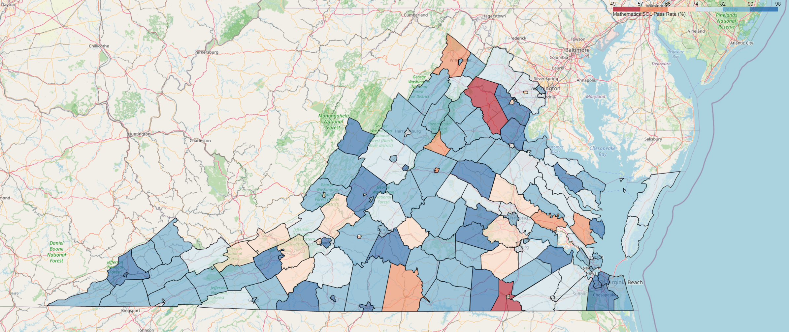
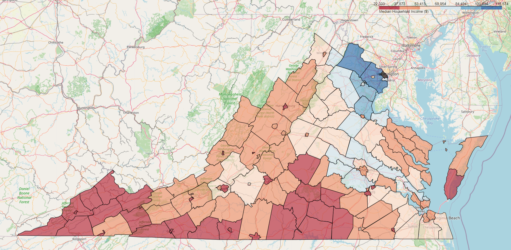
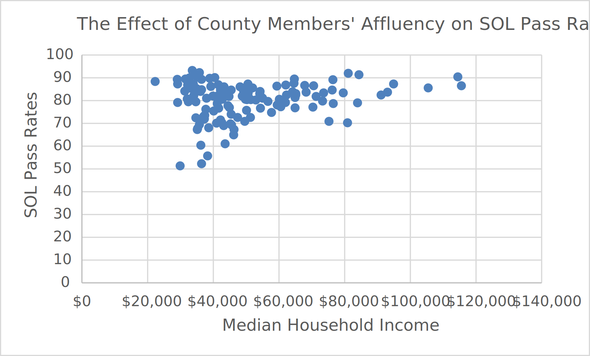

# Education in Virginia

Say what you will about the public school system, it sure helps you get data! Indeed, there is a lot
of data out there for the taking, and having recieved this public education, I wanted to know how good
this education is. After thinking a bit more, I decided to investigate how education quality is
distributed; that is, are some places getting better education than others just because of some
characteristics?

Educational Affluency         | Monetary Affluency      |
:----------------------------:|:------------------------:
         |    |

I made the chart above to illustrate on a map the quality of education. As you can see, there appears
to be no or very little correlation between educational levels and the representative person's
wealth. But this leaves out one key detail:

As you can see, there appears to be a bracket in which counties can land; all counties *can* have
excellent students, but not all have students like that. But the likelihood that a county has good
students increases with wealth. That is, **those who live in wealthy counties are more likely
to pass the SOL**. That is a very obvious fact, but there is a deeper conclusion in that:

These graphs measure the *parents'* wealth, not the county's. So this means that the richer parents
are, the more they are willing to contribute to their children's education. And this creates a
fundamental inequality in terms of education. This inequity must be fixed by allocating funds to
schools that need them (suprisingly, there are quite a few outliers on a school by school basis).
In richer counties, the parents provide the initiative to help their child pursue a better education. 
Since the poorer counties do not have the resources to help children pursue their interests, the state
must help.
